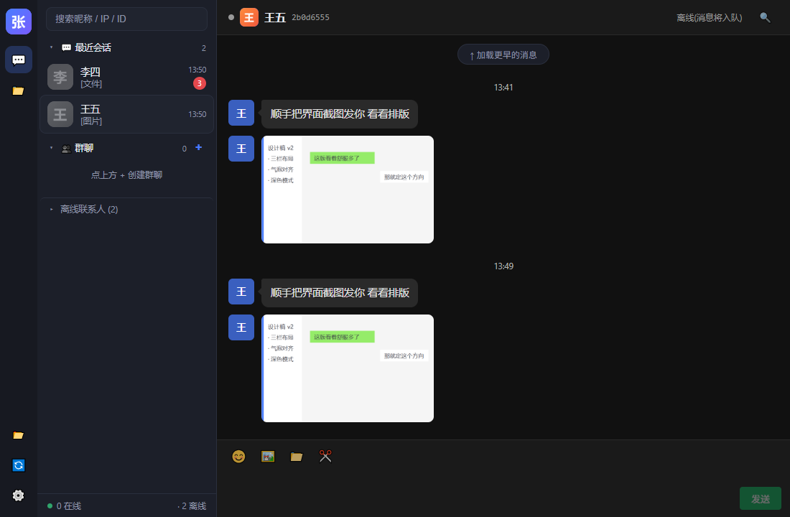
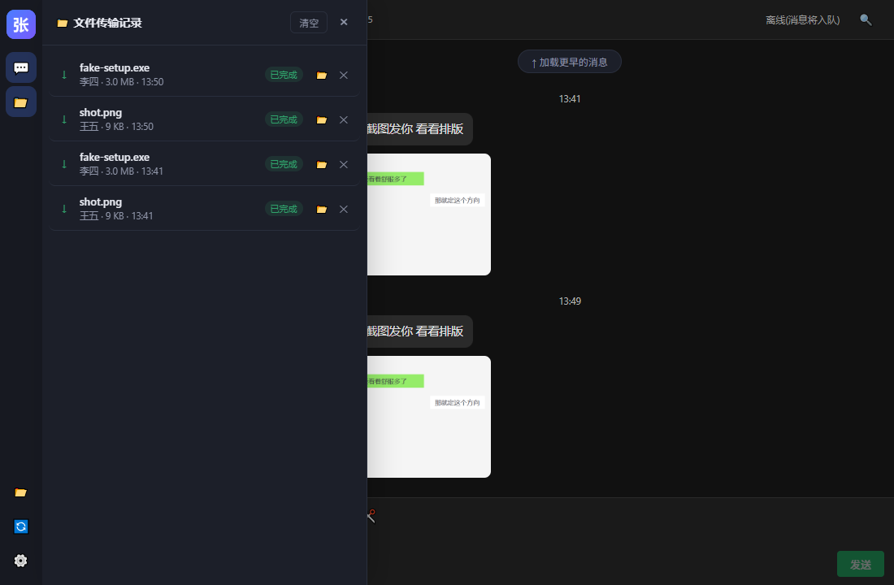
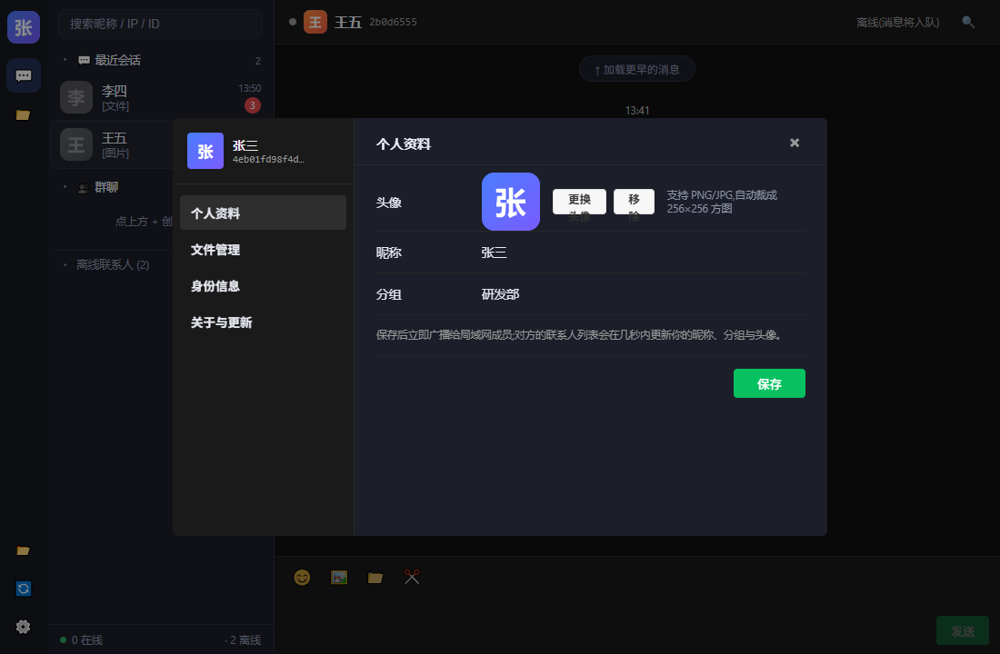
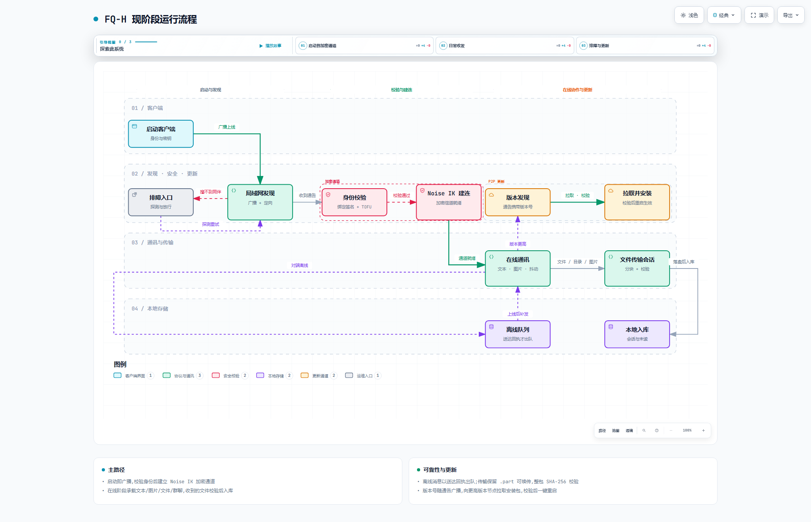

# FQ-H

> 局域网即时通讯客户端 —— Rust + Tauri 重写的现代化实现。
> **零服务器依赖**:发现、聊天、文件传输、头像同步、版本更新全部在局域网内点对点完成。

_LAN instant messaging, rewritten in Rust + Tauri. No server, fully peer-to-peer on your local network._

## 特性

**网络与安全**

- 局域网自动发现:UDP 广播 + **每网卡定向发送**(多宿主/VPN 环境可用),新节点上线立即互发通告(ANSENTRY 等效)
- **Noise IK 加密通道**:身份 Ed25519 + Noise 静态密钥绑定签名,TOFU 密钥固定,静态密钥变更会告警
- 离线消息队列:只有收到对端**送达回执**才出队,连接中途死亡不会丢消息

**聊天体验**

- QQ 式三栏布局 + 微信式气泡:头像、时间分割线、✓/✓✓ 状态、无边框输入区、深色模式自适应
- 表情面板、**截屏发送**、**粘贴图片发送**、**拖拽文件发送**
- 图片/文件气泡(缩略图懒加载)、**点图放大查看**(灯箱:滚轮缩放/拖动/双击 1x-2x)
- **消息右键菜单**:复制文本、**转发到联系人/群**、删除(仅本机)
- **资料卡**:点任意头像看昵称/分组/IP/版本/NodeId,可一键发消息或**抖一抖**
- **窗口抖动**(飞秋经典):摇晃对端窗口并留下一条提示记录
- **正在输入**:对方打字时聊天头部显示动态提示(提示类消息,不落库)
- **群内 @提醒**:@ 成员时对方收到红标「有人@我」与提示
- **引用回复**:右键消息 →「引用」,输入区出现引用条,气泡内显示被引内容并点击定位原消息
- **会话置顶 / 免打扰 / 全部已读**:右键会话置顶或静音(未读只留小点),侧栏底部一键全部已读
- 群聊:本地群定义 + 发送方扇出,接收方按消息自动建群(群内显示发送者)
- 会话列表(未读持久化、可移除)、分区折叠、历史分页、全文搜索
- 头像缺省时按 NodeId 生成稳定配色 + 首字,列表一眼可辨

**设置与网络诊断**

- **通用设置页**:主题(跟随系统 / 浅色 / 深色)、在线状态(在线 / 忙碌 / 勿扰 / 离开,切换立即广播)、**发送限速**(不限速 / 1 / 5 / 10 MB/s)
- **定向探测**:填对方 IP 单播握手一次,专治"搜不到同伴";**网段直扫**(启动自动 / 设置页手动 / CLI `/scan`);**一键放行 Windows 防火墙**(弹 UAC 确认)
- 一键打开数据目录 / 日志目录(出问题可直接把日志发出来排查)

**文件传输**

- 目录树传输、**断点续传**(`.part` 保留)、SHA-256 全文件校验
- **失败自动重试**:发送瞬断(中断/超时/分块失败)自动重试 2 次并提示进度;取消/拒绝/校验失败不重试
- 传输面板:进度、实时速度、**取消传输**;传输历史抽屉(跨重启保留)
- 接收确认流:可选保存位置 / 拒绝;群聊内文件按成员各发一份

**资料同步**

- 昵称、分组随在线通告实时更新
- 头像:通告只带 64 字节哈希,整图按需走加密通道拉取(校验后落库,离线也能显示)
- 一键更换头像(自动裁成 256×256 方图)

**自动更新(局域网 P2P)**

- 版本号随通告广播,发现更高版本可直接向对方**拉取安装包**,校验通过后一键重启完成更新
- 无需更新服务器,无需人工拷贝安装文件;也支持"每次先询问"模式

## 界面

> 截图来自真实运行的客户端(演示数据:张三 / 李四 / 王五)。

**主界面 —— QQ 式三栏 + 微信式气泡**:左侧图标栏与联系人/会话列表,右侧聊天区带头像、时间分割线、文件卡片与图片气泡,右下角为传输面板。



**文件传输记录**:活动传输显示进度与实时速度,可取消;历史记录跨重启保留,可打开文件/删除单条。



**个人资料设置**:头像、昵称、分组改完即广播给局域网成员(头像按需拉取,256×256 方图)。



## 运行流程

当前版本的主流程 —— **启动 → 局域网发现 → 身份校验 → Noise IK 加密通道 → 在线通讯 → 文件传输 → 本地入库**,并画出两条可恢复支线(离线补发、搜不到同伴时的探测重试)与 P2P 更新通路:



> 上面是静态截图;交互版(深浅色切换、自由缩放、路径追踪、3 章引导故事)可用 [archify](https://github.com/tt-a1i/archify) 从规格文件重新渲染:
>
> ```bash
> node <archify>/bin/archify.mjs deliver workflow \
>   docs/diagrams/fq-h-runtime-flow.workflow.json flow.html --quality showcase
> ```

## 项目结构

```text
crates/
  fq-proto    协议定义与编解码(MessagePack map 编码,前向兼容)
  fq-crypto   Ed25519 身份、Noise IK 安全通道、TOFU 固定表
  fq-net      发现/连接/心跳/文件传输会话(UDP + TCP)
  fq-store    SQLite 存储(逐级迁移,老库永远可打开)
  fq-core     应用核心:事件泵、会话、回执、离线队列、群扇出、更新与头像
apps/
  desktop     Tauri v2 + React 18 + TypeScript 桌面端
  fq-cli      命令行客户端(自动化验收/脚本驱动)
docs/         PROTOCOL.md(协议规格)、ARCHITECTURE.md(架构与设计决策)
scripts/      版本号同步等运维脚本
```

## 快速开始

> **下载预编译版本**:[Releases](https://github.com/zhtx2024/FQ-H/releases) ——
> Windows 安装包(NSIS)、免安装便携版 `fq-desktop.exe`、命令行 `fq-cli.exe`。

**依赖**:Rust(stable,edition 2024 需 ≥ 1.85)、Node 20+;Windows 上另需 WebView2 与 MSVC 工具链。

> ⚠️ `apps/desktop` 的编译会校验 `frontendDist`,因此**先构建前端**再跑 `cargo check/build -p fq-desktop`
> (否则 `tauri-build` 会报 `frontend/dist` 不存在)。纯核心库/CLI 开发不需要 Node。

```bash
# 命令行客户端(同机跑两个实例时需错开 TCP 端口)
cargo run -p fq-cli -- chat --name 张三
cargo run -p fq-cli -- chat --name 李四 --listen-port 24251 --data-dir ./data-b

# 桌面端(开发模式)
cd apps/desktop/frontend && npm install
cd .. && npx tauri dev

# 打包 Windows 安装包(NSIS)
cd apps/desktop && npx tauri build --config tauri.conf.json
```

## 开发约定

- **版本号单一来源**:根 `Cargo.toml`;`scripts/bump-version.ps1` 一键同步三处
  (`Cargo.toml` / `frontend/package.json` / `tauri.conf.json`),按改动幅度 bump patch/minor/major
- **测试**:`cargo test --workspace`;`cargo clippy --workspace --all-targets` 保持零警告
- **协议前向兼容**:未知字段/未知报文类型不得导致解码失败,新能力用能力位声明

## 文档

| 文档 | 内容 |
|---|---|
| [`docs/PROTOCOL.md`](docs/PROTOCOL.md) | 报文格式、分帧/分段、字段表、安全模型、前向兼容约定 |
| [`docs/ARCHITECTURE.md`](docs/ARCHITECTURE.md) | 分层契约、数据模型、群聊/更新/头像设计、踩坑记录 |
| [`docs/ROADMAP.md`](docs/ROADMAP.md) | 后续升级清单(功能 / 价值 / 成本 / 依赖)与已知限制 |

## 许可

[MIT](LICENSE)
